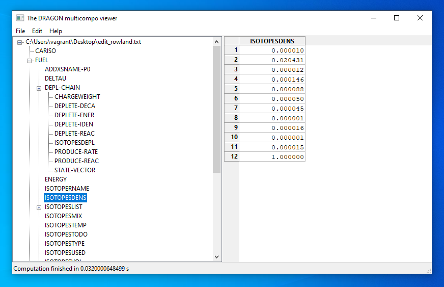

<h1 align="center">

</h1>

<h4 align="center">A pretty viewer for XSM_FILE / SEQ_ASCII output files generated by DRAGON / DONJON / APOLLO neutronic codes</h4>

## Demo

Linux

Windows

macOS

## About

As a DRAGON/DONJON user, you want to look inside a `LCM` object, such as
`LINKED_LIST`, `SEQ_ASCII` or `XSM_FILE`.
The simplest way to do this is to convert your object into `XSM_FILE` or `SEQ_ASCII` format

    SEQ_ASCII mySeqFile ; mySeqFile := myLCMObject ;

perform calculation and open the resulting output file with __asciiviewer__.

The initial version of __asciiviewer__ was written by Benjamin Toueg in 2009
and is available [here](https://code.google.com/archive/p/dragon-donjon-ascii-viewer/).

Here, the original source code was ported to run on python 3 with [wxpython 4](https://www.wxpython.org/).
Single file executables are generated with [pyinstaller](https://www.pyinstaller.org/) using [these workflows](.github/workflows)
via [github actions](https://github.com/tumregels/asciiviewer/actions).

## Installation

The easiest way to run __asciiviewer__
is to download the executable from [releases](https://github.com/tumregels/asciiviewer/releases/latest)
as shown in the [demo](#demo).

### From source

1. Install [Miniconda](https://docs.conda.io/projects/conda/en/latest/user-guide/install/index.html)
   (no admin privileges required). Conda is used because wxPython has native dependencies that pip
   alone does not reliably resolve on every platform.

2. Clone the project, then create and activate the environment:

        $ git clone https://github.com/tumregels/asciiviewer
        $ cd asciiviewer
        $ conda env create -f environment.yml
        $ conda activate asciiviewer
        (asciiviewer) $

3. Run the app:

        (asciiviewer) $ asciiviewer                  # or: python asciiviewer/main.py

To get a detailed traceback set [`PYTHONFAULTHANDLER`](https://docs.python.org/dev/using/cmdline.html#envvar-PYTHONFAULTHANDLER).

    (asciiviewer) $ export PYTHONFAULTHANDLER=1      # macOS / Linux
    (asciiviewer) > set PYTHONFAULTHANDLER=1         # Windows (cmd)

To open a specific DRAGON/DONJON/APOLLO output file from the command line

    (asciiviewer) $ asciiviewer ./path/to/file

To generate the single file executable on your computer

    (asciiviewer) $ pyinstaller --clean --noconfirm ./asciiviewer.spec

The above step will create an executable under the `dist` folder.

    $ ./dist/asciiviewer ./path/to/file

__Important__: single file executables can be called from terminal with or without file path.

### Releasing

The version is defined in `asciiviewer/_version.py`. To cut a release:

    bump2version minor               # or major / patch - updates the version, commits and tags
    git push --follow-tags

Pushing the tag triggers the [release workflow](.github/workflows/release.yml), which builds the
executables and attaches them to a GitHub release.

### Configuration

On the first run __asciiviewer__ will create an `.asciiviewer.cfg` config file inside
`HOME` directory with [this content](./asciiviewer/assets/default.cfg).
From this file you can disable sort and splash screen.

## Issues

Please report problems and bugs on the [issue tracker](https://github.com/tumregels/asciiviewer/issues).

### Known issues

- The executables are not code-signed, so you will get security warnings on macOS and Windows.
- On Ubuntu, a manual setup may fail with a `missing libgtk-x11-2.0.so.0` error. One fix is to
  reinstall the GTK library:

        sudo apt-get install --reinstall libgtk2.0-0

## License

[GPL-3.0](./LICENSE)